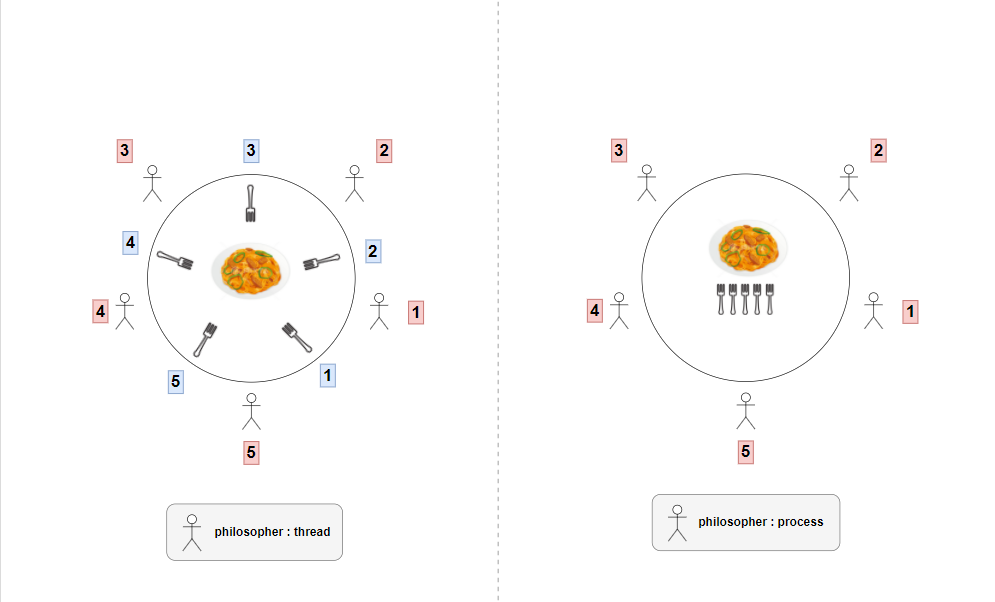

# Philoshphers

운영체제의 Deadlock 개념과 관련한 `식사하는 철학자 문제` 해결 과정을 `(1)Multi-threading`, `(2)Multi-processing`으로 시뮬레이션한 프로젝트입니다.

## Deadlock 발생 필요조건
1. Mutual Exclusion
2. Hold & Wait
3. No preemption
4. Circular Wait

## Deadlock 해결 방법

```
mutex fork[N]; // initialized to 1

void philosopher (int i) {

	if (id & 1)
		sleep(time_eat / 2);

	while (1) {
		think ();
		lock (fork[i]);
		lock (fork[(i+1) % N];
		eat ();
		unlock (fork[i]);
		unlock (fork[(i+1) % N];
	}
}
```

+ Deadlock의 발생 필요조건 중 Circular Wait를 위배

+ 철학자의 id가 홀수인지 짝수인지에 따라 쓰레드의 시작 시간을 달리함

+ 이는 Subject 중 아래의 요구사항을 고려하여 결정함
```
• Philosophers don’t speak with each other.
• Philosophers don’t know when another philosopher is about to die.
```

+ Starvation 은 별도의 쓰레드가 검사하도록 함

## 구현


### (1) philo
- `Multi-threading & Mutex`
- 철학자 : thread
- 각각의 fork에 대한 Mutex
- 각각의 철학자가 식사하지 못해 죽었는지를 검사하는 쓰레드들을 생성한다.
- 모든 철학자가 식사를 마치면 시뮬레이션을 종료한다.

### (2) philo_bonus
- `Multi-processing & Semaphore`
- 철학자 : process
- 남은 포크 수에 대한 Semaphore
- 각각의 철학자는 식사하지 못해 죽었는지를 검사하는 쓰레드들을 생성한다.
- 모든 철학자가 식사를 마치면 시뮬레이션을 종료한다. 이를 검사하기 위한 별도의 프로세스를 생성한다.

## 세부 내용

프로젝트와 관련된 세부 내용은 아래의 노션 페이지에 정리하였습니다.
+ [Notion](https://eastern-puppy-250.notion.site/Philosophers-bd78e83f3d794bd5a4b663c8f6ea6be6)
